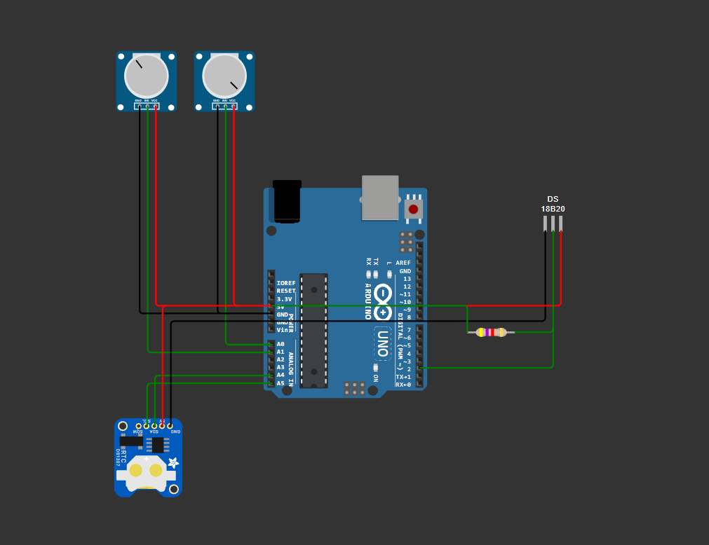
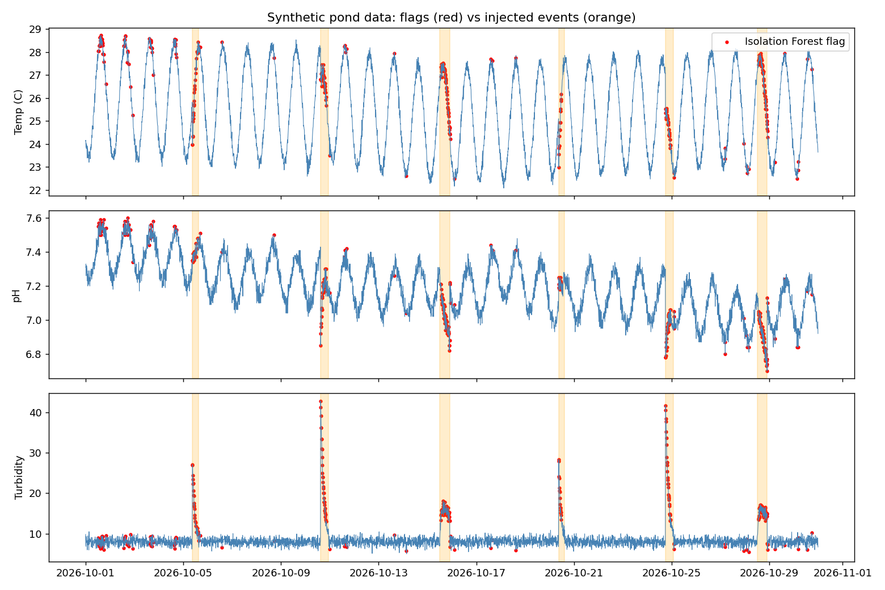
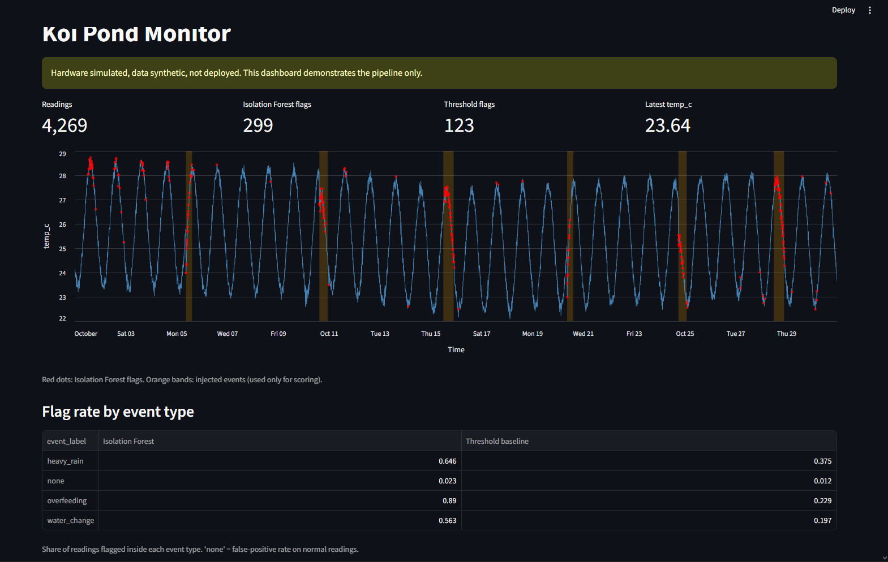
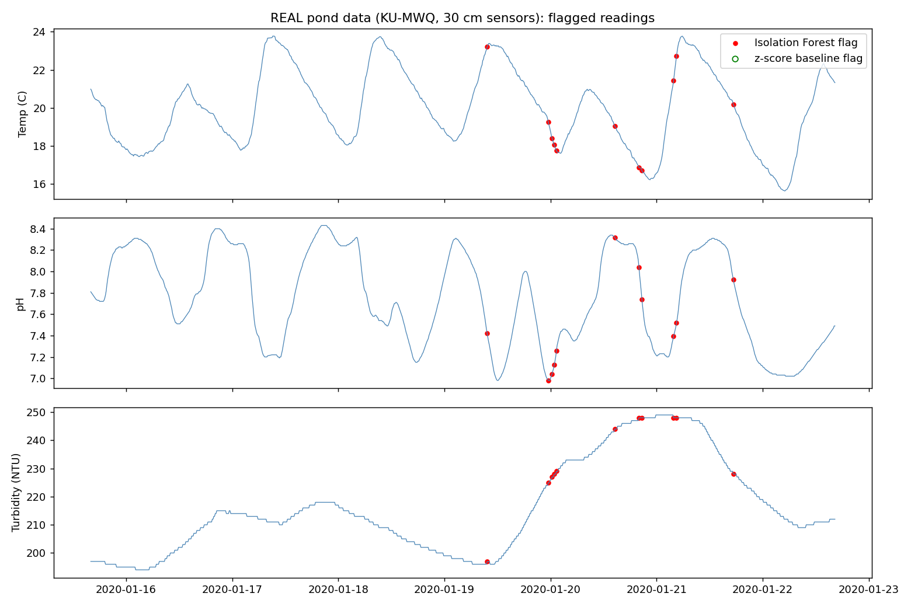

# koipondmonitor

Pond water-quality monitoring pipeline: simulated Arduino sensor circuit, SQL feature engineering, anomaly detection, and a dashboard.

> **Hardware is simulated (Wokwi). Pipeline results are on synthetic data, plus one validation run on a public real-world dataset. Not deployed.**
> This repo demonstrates a working pipeline. It does not claim data from a pond I monitored myself.

## Why
My family keeps koi and an orchard. Water quality (temperature, pH, turbidity) drives fish health. I wanted to design the full monitoring chain, from sensor to alert, before building it for real.

## Pipeline
```
Arduino sensors (simulated) -> CSV -> SQLite -> SQL features -> anomaly detection -> dashboard
```

| Step | File |
|---|---|
| Sensor circuit + logging sketch (Wokwi) | `Hardware/` |
| Synthetic data + event log | `Data/generate_synthetic.py` |
| Cleaning + feature engineering (SQL window functions) | `SQL/features.sql`, `build_features.py` |
| Isolation Forest vs threshold baseline | `anomaly_detection.py` |
| Dashboard | `dashboard.py` |
| Validation on real public data | `validate_public.py` |

## Hardware (simulated)
- Arduino Uno, DS18B20 temperature sensor (4.7k pull-up), DS1307 RTC
- Two potentiometers stand in for the pH and turbidity probes (analog, A0 and A1)
- Sketch prints `timestamp,temp_c,ph,turbidity` rows
- Real deployment would swap in an analog pH probe and a turbidity sensor, plus an SD card module


*Simulated in Wokwi.*

## Data
- `generate_synthetic.py` makes 30 days of readings every 10 minutes (seed 42)
- 6 injected, labeled events: 2 water changes, 2 heavy rains, 2 overfeedings
- Built-in faults: ~1% missing readings and 8 `-127.00` DS18B20 disconnect glitches

## Features (SQL)
Cleaning view, then 1h and 24h rolling means, reading-to-reading change, daily min/max, and deviation from the 24h mean, all with SQLite window functions. Events are joined as a label **for scoring only**, never as a model input.

## Results (synthetic data)
| Method | Precision | Recall | F1 | Events detected |
|---|---|---|---|---|
| Threshold baseline | 0.63 | 0.27 | 0.38 | 6/6 |
| Isolation Forest | 0.69 | 0.73 | 0.71 | 6/6 |



Both methods detect every event at least once. Isolation Forest flags far more of each event's duration at similar precision.


*Synthetic data, simulated hardware. Pipeline demonstration only.*

## Validation on real pond data



I ran the same cleaning, SQL feature engineering and Isolation Forest on a week of real sensor data from a fish pond (KU-MWQ, Khulna University, 15-22 Jan 2020): 9,623 raw readings, resampled to 1,005 ten-minute rows.

The dataset has no anomaly labels, so no precision or recall is reported.

- Isolation Forest flagged 11 readings (about 1%, set by the contamination parameter, not discovered by the model).
- All 11 fall between 19 and 21 Jan, a period of rapid turbidity rise and fast pH and temperature swings.
- A global z-score baseline (|z| > 3) flagged nothing, so the two methods did not overlap. Fixed pond thresholds were unusable here because turbidity sits at 194-249 NTU.

The flags show where the data changes fastest, not confirmed contamination. Limitations: one week, one site, no ground truth.

**Dataset:** Nahid et al., "KU-MWQ: A Dataset for Monitoring Water Quality Using Digital Sensors", Mendeley Data, DOI 10.17632/34rczh25kc.4
**Licence:** [CC BY 4.0](https://creativecommons.org/licenses/by/4.0/). The original file is included unmodified in `Data/Public/`. This repo's scripts resample it to 10-minute medians and add derived features; no changes are made to the file itself.

## Limitations
- **Synthetic data.** The model finds anomalies I injected. This shows the pipeline works, not that it works on a real pond.
- **False positives early on.** The first days are flagged because the generator's pH drifts high there. The model flags "unusual", not "bad".
- **Contamination is set to 0.07**, close to the true event rate (~6.6%). That is prior knowledge a real deployment would not have.
- **Baseline thresholds were chosen by hand**, so the comparison depends on them.
- Rolling windows are short at the start of the series.
- The public-data check is unlabeled, so it shows the pipeline runs on real sensor data, not that the detector is accurate on it.

## Run it
```
pip install -r requirements.txt
python Data/generate_synthetic.py
python build_features.py
python anomaly_detection.py
python validate_public.py
python -m streamlit run dashboard.py
```
`validate_public.py` needs `Data/Public/Sensor data for 30 cm.xlsx` (download from the Mendeley link above).

## Next steps
- Build the real hardware (pH probe calibration, SD logging, waterproof enclosure) and collect real pond data
- Add alert rules and a notification path
